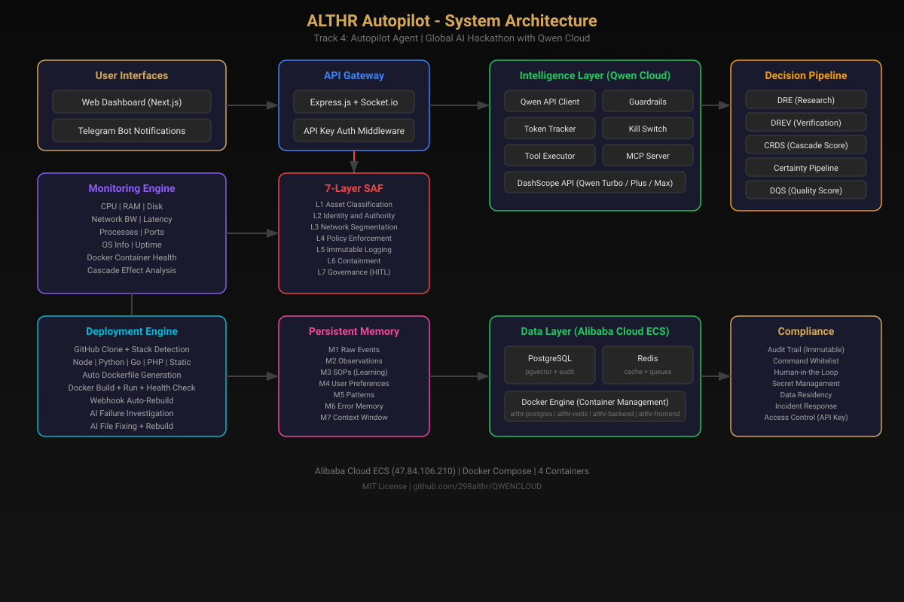
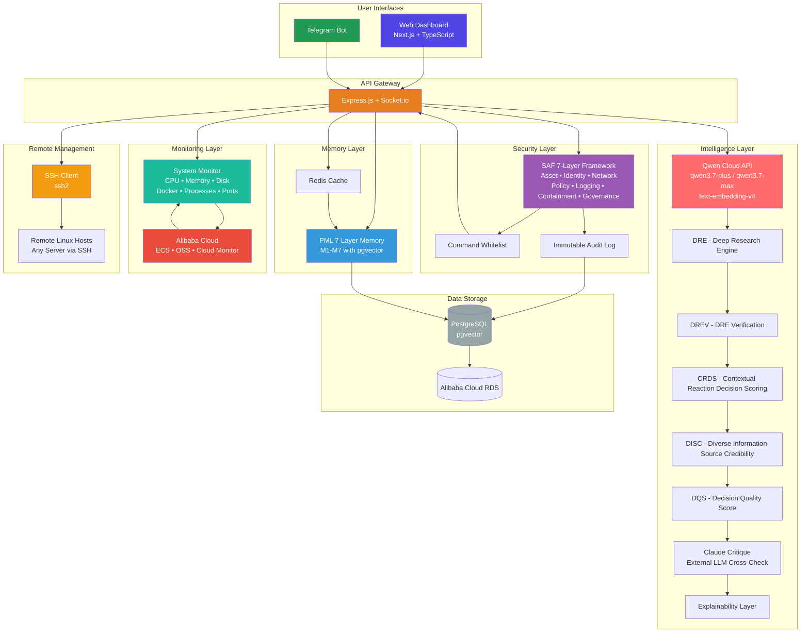
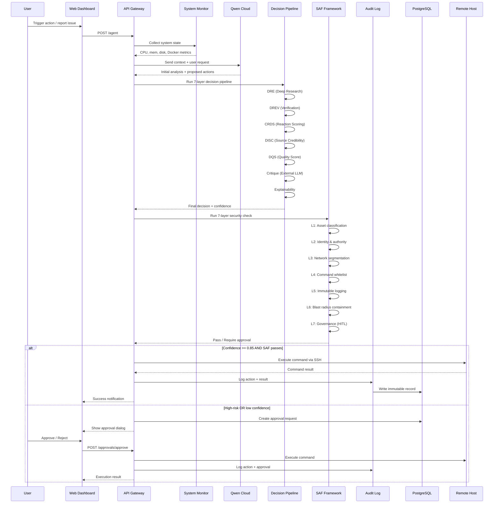
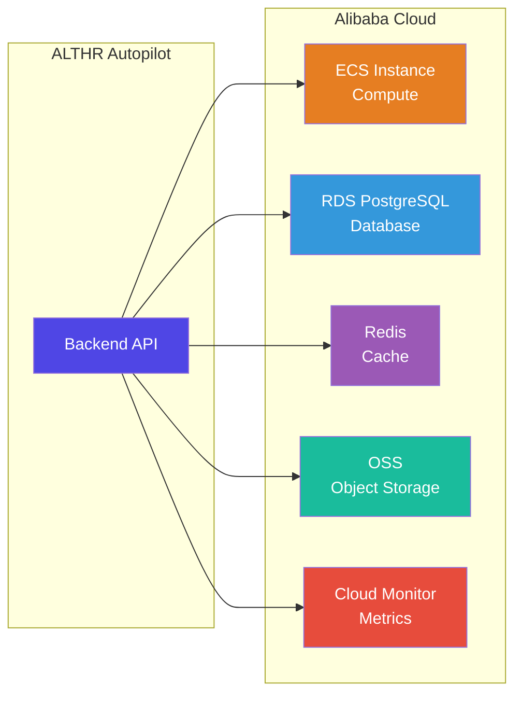
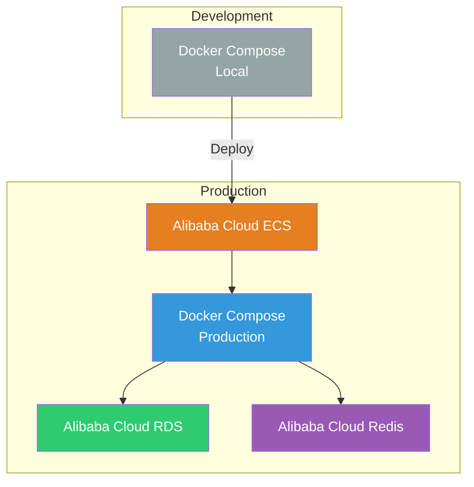
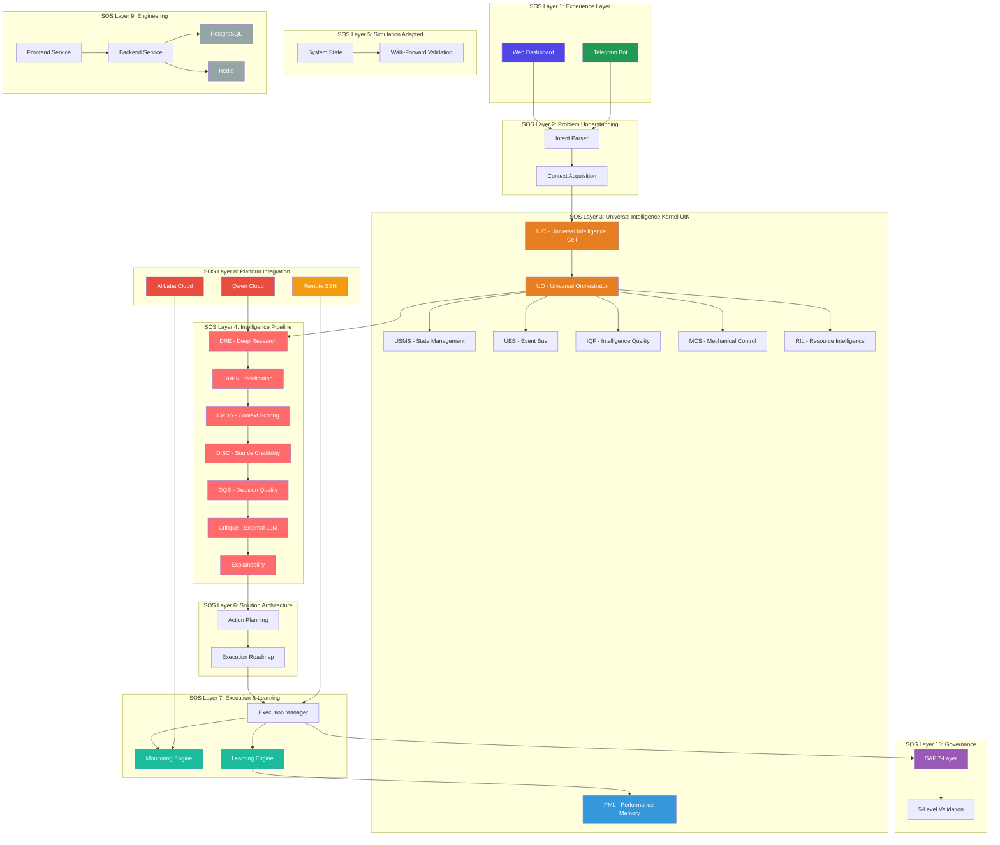

# ALTHR Autopilot - Architecture Diagram

This document provides a clear visual representation of the ALTHR Autopilot system architecture, showing how Qwen Cloud connects to the backend, database, and frontend.

## Architecture Diagram (SVG)

The SVG file is at `docs/architecture.svg`. Open it in any browser to view or export as PNG.

---

## High-Level System Architecture

---

## Data Flow: Agent Decision Pipeline

---

## Component Details

### User Interfaces

- **Web Dashboard** (Next.js + TypeScript + Tailwind CSS)
  - Real-time monitoring dashboard
  - AI agent chat interface
  - Approval queue management
  - Remote SSH host management
  - Decision intelligence visualization

- **Telegram Bot** (Node.js + Telegram Bot API)
  - Mobile-first control interface
  - Command execution
  - Approval/reject actions
  - System status alerts

### API Gateway

- **Express.js + Socket.io**
  - REST API for all operations
  - WebSocket for real-time updates
  - Route handlers for monitoring, decisions, memory, security
  - Authentication and authorization middleware

### Intelligence Layer (Qwen Cloud)

- **Qwen Models**: qwen3.7-plus, qwen3.7-max, text-embedding-v4
- **7-Layer Decision Pipeline**:
  1. **DRE** (Deep Research Engine): Generates candidate solutions
  2. **DREV** (DRE Verification): Validates evidence for each candidate
  3. **CRDS** (Contextual Reaction Decision Scoring): Scores action impact
  4. **DISC** (Diverse Information Source Credibility): Ranks information sources
  5. **DQS** (Decision Quality Score): Calculates overall decision quality
  6. **Critique** (Claude Critique): External LLM cross-check for bias
  7. **Explainability**: Human-readable reasoning explanation

### Security Layer (SAF 7-Layer Framework)

1. **L1 - Asset Classification**: Critical / Important / Normal
2. **L2 - Identity & Authority**: Admin / Operator / Viewer
3. **L3 - Network Segmentation**: Local execution only
4. **L4 - Policy Enforcement**: Command whitelist
5. **L5 - Immutable Logging**: Audit log with triggers
6. **L6 - Containment**: Blast radius limits
7. **L7 - Governance**: Human-in-the-loop for high-risk actions

### Memory Layer (PML 7-Layer)

1. **M1 - Episodic**: Specific events and experiences
2. **M2 - Semantic**: Facts and concepts
3. **M3 - Procedural**: How-to knowledge
4. **M4 - Working**: Short-term context
5. **M5 - Emotional**: Sentiment and impact
6. **M6 - Social**: User preferences and interactions
7. **M7 - Meta-cognitive**: Learning and self-improvement

### Monitoring Layer

- **System Metrics**: CPU, memory, disk usage
- **Docker**: Container status, logs, resource usage
- **Processes**: Top processes by CPU/memory
- **Ports**: Listening ports and connections
- **Alibaba Cloud Integration**: ECS instance metrics, OSS storage, Cloud Monitor

### Data Storage

- **PostgreSQL (pgvector)**: Primary database with vector embeddings
- **Alibaba Cloud RDS**: Managed PostgreSQL for production
- **Redis**: Cache layer for performance

### Remote Management

- **SSH Client (ssh2)**: Generic SSH connection to any Linux host
- **Remote Hosts**: Configured via `REMOTE_HOSTS` environment variable
- **Capabilities**: Docker management, file operations, process control, port scanning

---

## Alibaba Cloud Integration

**Implementation**: See `backend/src/utils/alibaba.js` for Alibaba Cloud SDK integration.

---

## Deployment Architecture

**Production Config**: See `docker-compose.prod.yml` for resource limits and production settings.

---

## SOS Layer Mapping

ALTHR Autopilot implements the Solution Operating System (SOS) architecture as a domain-specific implementation for server operations automation.

**Mapping Details:**
- **SOS V1 (Foundation)**: Core philosophy alignment
- **SOS V2 (UIK)**: UIC, UO, USMS, UEB, IQF, PML, MCS, RIL implemented
- **SOS V3 (Problem Understanding)**: Intent parser, context acquisition
- **SOS V4 (Intelligence Pipeline)**: DRE, DREV, CRDS, DISC, DQS, Critique, Explainability
- **SOS V5 (Simulation)**: Adapted to system state + walk-forward validation (SAF provides governance)
- **SOS V6 (Solution Architecture)**: Action planning, execution roadmap
- **SOS V7 (Execution & Learning)**: Orchestrator, monitor, learning engine
- **SOS V8 (Platform Integration)**: Qwen Cloud, Alibaba Cloud, Remote SSH
- **SOS V9 (Engineering)**: Microservices, event-driven, polyglot persistence
- **SOS V10 (Governance)**: SAF 7-layer, 5-level validation

For detailed mapping, see [`docs/sos-althr-mapping.md`](docs/sos-althr-mapping.md).
